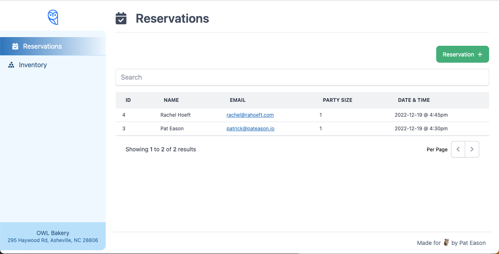

# Wisely Web Test



## Requirements

* [Docker Desktop](https://www.docker.com/products/docker-desktop/)
* [Node 16+](https://nodejs.org/en/blog/release/v16.16.0/)

## Getting Started

- run `docker-compose up`

### JetBrains IDEs
If using a JetBrains IDE you may need ot install the dependencies for `api`
and `frontend` locally _before_ creating the Docker images. In that case run
the following from the repo root:

```shell
cd api
yarn install
cd ../frontend
yarn install
```
